# 作业二：边缘检测和边缘链接

姓名：欧阳鸿荣	

学号：161220096 

邮箱：895254752@qq.com 

手机：13055644369


## 1. 实现细节

### 1.0 综述

本次实验分为两个部分：边缘检测和边缘链接。其中，边缘检测我实现了5种方法，分别是：

- Roberts算子法
- Prewitt算子法
- Sobel算子法
- Marr-Hildreth法
- Canny法

边缘链接实现了一种方法：

- Moore边界追踪法

由于本次实验所用方法较多，因此代码也分为多个模块，具体如下，其中加粗部分为框架代码：

| 文件名             | 功能                          |
| ------------------ | ----------------------------- |
| **edge_test**      | 边缘检测和边缘链接的测试入口  |
| **my_edge**        | 边缘检测入口，整合了各种方法  |
| my_roberts         | Roberts算子                   |
| my_prewitt         | Prewiit算子                   |
| my_sobel           | Sobel算子                     |
| my_marr            | Marr-Hildreth边缘检测算法     |
| my_canny           | Canny边界检测器               |
| Threshold          | 阈值确定函数                  |
| **my_edgelinking** | 基于Moore边界追踪法的边缘链接 |

下面分别介绍各种方法的实现：

## <div STYLE="page-break-after: always;"></div>

### 1.1 Robert

Robert算子是一个具有对角优势的二维模板，是本次实验中采用的最简单的方法，其模板如下：
$$
\begin{bmatrix}
 -1&0 \\ 
 0&1 
\end{bmatrix}
\begin{bmatrix}
 0&-1 \\ 
 1&0 
\end{bmatrix}
$$
通过该梯度算子，卷积计算$g_x,g_y$，从而得到梯度幅度$M(x,y)$，采用单阈值法，将$M(x,y)$同阈值$thresh$进行对比，当大于阈值时则认为点$(x,y)$为边缘。

阈值的选择上，这里给出了一个简单的自适应函数，可以根据灰度平均值对不同的图进行优化。

```matlab
function [threshold] = Threshold(input_image,scale)
%   根据灰度平均值，来得到阈值的确定
means = mean(input_image(:));
cutoff = scale*means;
threshold = sqrt(cutoff);
end
```

下面给出 Robert 算子的代码

```matlab
function [output] = my_roberts(input_image)
%MY_ROBERTS ROBERTS算子下的边缘检测算法
[m,n] = size(input_image);
res = zeros(m,n);
thresh = Threshold(input_image,0.30);%设定阈值
img = input_image;

for i=1:m-1
    for j=1:n-1
        Gx = img(i,j) - img(i+1,j+1);
        Gy = img(i+1,j) - img(i,j+1);
        robertsNum = sqrt(Gx^2+Gy^2);
        res(i,j) = (robertsNum > thresh);
    end
end

output = logical(res);
end
```

Prewitt和Sobel算子也是基于同样的原理，只是选取的算子模版不同，因此在原理上不多赘述。

## <div STYLE="page-break-after: always;"></div>

### 1.2 Prewitt算子

Prewitt算子考虑了中心点对端数据的性质，并携带有关边缘的更多信息，是对Robert算子的优化，其模板如下
$$
\begin{bmatrix}
 -1&-1  &-1 \\ 
 0&0  &0 \\ 
 1&  1&1 
\end{bmatrix}
\begin{bmatrix}
 -1&0  &1 \\ 
 -1&0  &1 \\ 
 -1&0  &1 \\ 
\end{bmatrix}
$$

```matlab
function [output] = my_prewitt(input_image)
%MY_PREWITT PREWITT算子下的边缘检测算法
[m,n] = size(input_image);
res = zeros(m,n);
thresh = Threshold(input_image,1.8);%设定阈值
img = input_image;
for i=2:m-1 
    for j=2:n-1
        Gx = img(i-1,j+1)-img(i+1,j+1)+img(i-1,j)-img(i+1,j)+img(i-1,j-1)-img(i+1,j-1);
        Gy = img(i-1,j+1)+img(i,j+1)+img(i+1,j+1)-img(i-1,j-1)-img(i,j-1)-img(i+1,j-1);
        PrewittNum= sqrt(Gx^2+Gy^2);
        res(i,j) = (PrewittNum > thresh);
    end
end
output = logical(res);
end
```

### 1.3 Sobel算子

Sobel算子对权值进行了调整，使得其能更好地抑制平滑噪声，其模板如下
$$
\begin{bmatrix}
 -1&-2  &-1 \\ 
 0&0  &0 \\ 
 1&  2&1 
\end{bmatrix}
\begin{bmatrix}
 -1&0  &1 \\ 
 -2&0  &2 \\ 
 -1&0  &1 \\ 
\end{bmatrix}
$$

```matlab
function [output] = my_sobel(input_image)
%MY_SOBEL 索贝尔算子下的边缘检测算法
% input_image = gauss_filter(input_image);
[m,n] = size(input_image);
res = zeros(m,n);
thresh = Threshold(input_image,2.8);
img = input_image;
for i=2:m-1
    for j=2:n-1
        Gx = img(i-1,j+1)+2*img(i,j+1)+img(i+1,j+1)-img(i-1,j-1)-2*img(i,j-1)-img(i+1,j-1);
        Gy = img(i-1,j-1)+2*img(i-1,j)+img(i-1,j+1)-img(i+1,j-1)-2*img(i+1,j)-img(i+1,j+1);
        sobelNum= sqrt(Gx^2+Gy^2);
        res(i,j) = (sobelNum > thresh);
    end
end
output = logical(res);
end
```

### 1.4 Marr-Hildreth边缘检测算法

Marr-Hildreth是一种更为高级的方法，由于该方法考虑了边缘本身的性质，通过二阶导的方法使得边缘检测的效果更加良好。其使用的算子是拉普拉斯算子。这里结合代码讲述该算法的实现：

##### （1）使用 $n\times n$的高斯低通滤波器对输入图像滤波，并计算滤波后图像的拉普拉斯。

这里采用的是一种经验法则：一个大小为$n\times n$的$LoG$离散滤波器，其$n$值应是大于等于$6\sigma$的最小奇整数

```matlab
function [output] = my_marr(input_image,sigma)
%MY_MARR Marr-Hildreth边缘检测算法
%   此处显示详细说明
[m,n] = size(input_image);
res = zeros(m,n);
nsize = ceil(3*sigma)*2+1; % 滤波器尺寸n为大于等于6sigma的最小奇整数
% 产生LoG滤波器,并使得滤波器的系数之和为0
LoG = fspecial('log',nsize,sigma);
LoG = LoG - mean(LoG(:));%矩阵每一项减去均值，则滤波器系数之和为0
% 利用Log滤波器对图像滤波
b = filter2(LoG,input_image);
```

##### （2）找到步骤（1）中图像的零交叉点

在滤波后的图像$g(x,y)$的任意像素$p$处，寻找零交叉的一种方法是用以$p$为中心的一个$3\times3$邻域。$p$点的零交叉意味着至少有两个相对的邻域像素符号不同。有四种要测试的情况：左右、上下和两个对角。如果$g(x,y)$的值与一个阈值比较，那么不仅相对邻域的符号不同，而且他们的数值差的绝对值还必须超过这个阈值。此时，我们称$p$为一个零交叉点。

```matlab
% 设置零交叉阈值（基于均值或者最大值的百分比）
% thresh =  0.75*mean(abs(b(:)));
thresh = 0.05*max(abs(b(:)));
% 寻找滤波后的零交叉点：寻找零交叉的一种方法是以p为中心的一个3*3邻域，如果g(x,y)的值与一个阈值比较，
% 则不仅相对邻域的符号不同，并且他们数值差的绝对值还超过阈值
op1 = [0,-1; -1,0; -1,-1; -1, 1]; %分别代表左右、上下和两个对角
op2 = [0, 1;  1,0;  1, 1;  1,-1];
for i = 2:m-1
    for j = 2:n-1
        p = [i,j];
        for k = 1:4
            xy1 = p + op1(k,:);
            xy2 = p + op2(k,:);
            x = b(xy1(1),xy1(2)); %相对邻域的两个值
            y = b(xy2(1),xy2(2));
            t = b(i,j);
%             if (x*y<0)&&(abs(x-y)>thresh) %相对邻域的符号不同，并且他们数值差的绝对值还超过阈值
%                 res(i,j)=1;
%                 break;
%             end
            if (t<0&&x>0)&&(abs(x-t)>thresh) %相对邻域的符号不同，并且他们数值差的绝对值还超过阈值
                res(i,j)=1;
                break;
            end
            if (t<0&&y>0)&&(abs(y-t)>thresh) %相对邻域的符号不同，并且他们数值差的绝对值还超过阈值
                res(i,j)=1;
                break;
            end
        end
    end
end
```

这里注释掉的地方为我原本对于书上P461页（也就是上面那段文字）的理解，但是这样做出来的效果并非书上所说的像素级。查阅资料后发现貌似能作出像素级效果的与那段文字有所差异，可能是我理解上有所偏差。

### 1.5 Canny边缘检测器

Canny边缘检测器是上述讨论过的方法中最优秀的。但是我实现时并没有实现出连接分析来连接边缘，导致图像断断续续。但是除去这个断断续续，其边缘连接效果还是很好的。其原理结合代码说明如下

##### （1）用一个高斯滤波器平滑输入图像

```matlab
function [output] = my_canny(input_image)
%MY_CANNY Canny边缘检测算法
% 1.用一个高斯滤波器平滑输入图像
imgsrc = im2uint8(input_image);
sigma = 3;  
N = 3;            
N_row = 2*N+1;
gausFilter = fspecial('gaussian', [N_row,N_row], sigma);
img= imfilter(imgsrc, gausFilter, 'replicate');

[m,n] = size(img);
img = double(img);
M = zeros(m, n); 
sector = zeros(m, n); %表示角度幅值图像
canny1 = zeros(m, n); %非极大值抑制后图像
res = zeros(m, n);  %结果图像
```

##### （2）计算梯度幅值图像和角度图像

```matlab
% 2.计算梯度幅值图像和角度图像
for i = 2:(m-1)
    for j = 2:(n-1)
        %用Sobel算子进行卷积计算梯度幅值和方向
        Gx = img(i-1,j+1)+2*img(i,j+1)+img(i+1,j+1)-img(i-1,j-1)-2*img(i,j-1)-img(i+1,j-1);
        Gy = img(i-1,j-1)+2*img(i-1,j)+img(i-1,j+1)-img(i+1,j-1)-2*img(i+1,j)-img(i+1,j+1);
        M(i,j) = sqrt(Gx^2+Gy^2);
        tem = atand(Gx/Gy);
        if (tem<22.5)&&(tem>-22.5)
            sector(i,j) =  1;     %水平边缘
        elseif (tem<-157.5)||(tem>157.5)
            sector(i,j) =   2;    %垂直边缘
        elseif (tem<-22.5)&&(tem>-67.5)
            sector(i,j) =   3;    %左上-右下
        else
            sector(i,j) =  4;     %右上-左下
        end
    end    
end
```

##### （3）对梯度赋值图像应用非最大抑制

```matlab
% 3.对梯度赋值图像应用非最大抑制
op1 = [0,-1; -1,0; -1,-1; -1, 1]; %分别代表水平、垂直和左上右下，左下右上
op2 = [0, 1;  1,0;  1, 1;  1,-1]; %分别代表水平、垂直和左上右下，左下右上
for i = 2:(m-1)
    for j = 2:(n-1)
        canny1(i,j) = 0;
        k = sector(i,j);
        a = [i,j] + op1(k,:);
        b = [i,j] + op2(k,:);
        x = M(a(1),a(2)); %相对邻域的两个值
        y = M(b(1),b(2));
        if ( M(i,j)>x )&&( M(i,j)>y)
            canny1(i,j) = M(i,j);
        end
    end
end
```

##### （4）用双阈值处理来检测边缘

```matlab
% 4.用双阈值处理来检测边缘
ratio = 2.5;
lowTh = 15;
highTh = ratio*lowTh;
neighbour=[0 1;1 1;1 0;1 -1;0 -1;-1 -1;-1 0;-1 1];  %和当前像素坐标相加得到八个邻域坐标
for i = 2:(m-1)
    for j = 2:(n-1)        
        if canny1(i,j)<lowTh %低阈值处理
            res(i,j) = 0;
        elseif canny1(i,j)>highTh %高阈值处理
            res(i,j) = 1;
        else %介于之间的看其8领域有没有高于高阈值的，有则可以为边缘
            for k =1:8
                b = [i,j] + neighbour(k,:);
                if canny1(b(1),b(2))> highTh
                    res(i,j) = 1;
                    break;
                end
            end
        end
    end
end
```

## <div STYLE="page-break-after: always;"></div>

### 1.6 Moore边界追踪法

Moore边界追踪法是一个基本的边界追踪算法，对一个二值区域$R$或给定边界的算法如下：

1. 令起始点$b_0$为图像中左上角标记为1的点（在代码实现中由于给定起点因此没有用到这条性质）。使用$c_0$表示$b_0$西侧的邻点。从$c_0$开始顺时针方向考察$b_0$的八个邻点。令$b_1$表示所遇到的值为1的第一个邻点，令$c_1$是序列中$b_1$之前的点。存储$b_0$和$b_1$的位置。
2. 令$b=b_1,c=c_1$
3. 从$c$开始顺时针方向前进，令$b$的八个邻点为$n_1,n_2,..,n_8$。找到第一个标为1的点$n_k$
4. 令$b=n_k,c=n_{k-1}$，同时标记$n_k$为0（避免死循环）
5. 重复步骤3、4，直到找不到邻点中标为1的点

其代码实现如下：

```matlab
function output = my_edgelinking(binary_image, row, col)
[m,n] = size(binary_image);
b = [row,col];
img = binary_image;

if img(row,col)~=1
    display('这个点不在边界上');
    output = [];
end

curr_d = 1; %当前探索方向
res=[row,col];
img(row,col) = 0;
neighbour=[0 1;1 1;1 0;1 -1;0 -1;-1 -1;-1 0;-1 1];  %和当前像素坐标相加得到八个邻域坐标

while true
    for i = 1:8 %不断探索八邻域上的点
        curr_d = mod(curr_d-1,8)+1;
        c = b + neighbour(curr_d,:); %八邻域上的点
        x = c(1);
        y = c(2);
        if x>=1 && x<=m && y>=1 && y<=n
            if img(x,y)==1
                curr_d  = curr_d -1; %更新当前方向
                res = [res;[x,y]]; %将点加入结果
                img(x,y) = 0;   %避免死循环
                b = c;
                break;
            end
        end
        curr_d = curr_d + 1;
    end
    if i == 8 %其八邻域上都没有边界点了，退出返回
        break;
    end
end
output = res;
end
```

## 2. 结果

### 2.1 实验设置

实验环境为 **Matlab R2018a**，代码放在```code```目录下。其中```test_edge.m```为测试的入口。其中```my_edge.m```集成了实现的各种边缘检测函数，```my_edgelinking.m```实现了边界追踪。

下面讲述如何对代码进行测试，可以根据需要随意组合。

##### (1) 读取图像并转为灰度图

```matlab
% 选择要读取的图片
imgTest = im2double(imread('../asset/image/rubberband_cap.png'));
imgTestGray = rgb2gray(imgTest); %将输入转为灰度图
```

##### (2) 分别以大图呈现边缘检测效果

```matlab
% % 1.库函数效果
img_edge_original = edge(imgTestGray);
figure;clf;imshow(img_edge_original);title('库函数效果')
% 2.roberts算子
img_edge_roberts = my_roberts(imgTestGray);
figure;clf;imshow(img_edge_roberts);title('Roberts效果')
% % 3.prewitt算子
img_edge_prewitt = my_prewitt(imgTestGray);
figure;clf;imshow(img_edge_prewitt);title('Prewitt效果')
% % 4.sobel算子
img_edge_sobel = my_sobel(imgTestGray);
figure;clf;imshow(img_edge_sobel);title('Sobel效果')
% % 5.Marr-Hildreth方法
img_edge_marr = my_marr(imgTestGray,4);
figure;clf;imshow(img_edge_marr);title('Marr效果')
% % 6.Canny方法
img_edge_canny = my_canny(imgTestGray);
figure;clf;imshow(img_edge_canny);title('Canny效果')
```

##### (3) 选取特定图像与原图对比

```matlab
% 对比模版
subplot(1,2,1);imshow(imgTestGray);hold on;title('原灰度图','FontSize',12);
subplot(1,2,2);imshow(img_edge_roberts);hold on;title('Roberts效果','FontSize',12);
```

##### (4) 将自己实现的效果与库函数对比

```matlab
% 所有方法对比
subplot(2,3,1);imshow(img_edge_original);hold on;title('库函数','FontSize',12);
subplot(2,3,2);imshow(img_edge_roberts);hold on;title('Roberts算子','FontSize',12);
subplot(2,3,3);imshow(img_edge_prewitt);hold on;title('Prewitt算子','FontSize',12);
subplot(2,3,4);imshow(img_edge_sobel);hold on;title('Sobel算子','FontSize',12);
subplot(2,3,5);imshow(img_edge_marr);hold on;title('Marr-Hildreth','FontSize',12);
subplot(2,3,6);imshow(img_edge_canny);hold on;title('Canny','FontSize',12);
```

##### (5) 对```my_edge```函数进行集成测试

```matlab
% my_edge_集成测试
img_edge_marr = my_edge(imgTestGray,'c');
figure;clf;imshow(img_edge_marr);title('myedge测试')
```

其中参数对应分别为方法的首字母小写，如```'c'```表示Canny方法，```'r'```表示Roberts算子方法，

##### (6) 选取待追踪的图像，并设置背景

```matlab
% 边缘追踪步骤1：选择要追踪的二值图 
img_link = img_edge_marr;  %准备对其边缘连接的图
imtool(img_link);
background = im2bw(imgTest, 1);
```

##### (7) 选取边缘追踪的起始点

```matlab
% 边缘追踪步骤2：选取边缘追踪的起始点
% rubberband_cap
col = 170;
row = find(img_link(:,col),1);
```

##### (8) 库函数方法

```matlab
dim=size(img_link);
col=round(dim(2)/2)-90;  %设定一个列坐标
row=find(img_link(:,col),1); %在该列中找到第一个不为0的像素坐标
CONNectivity=8; %8联通方式
Bxpc = bwtraceboundary(img_link, [row,col], 'N',8);
```

##### (9) 自己实现的方法

```matlab
Bxpc = my_edgelinking(img_link, row , col);
```

##### (10) 结果展示

```matlab
figure; clf; imshow(background);title('边缘追踪','FontSize',12);
hold on;
plot(Bxpc(:,2), Bxpc(:,1), 'w', 'LineWidth', 1);
title('边缘追踪','FontSize',12);
```

### 2.2 实验结果

#### (1) Roberts算子
图1.rubberband：cap.png  **scale = 0.30**

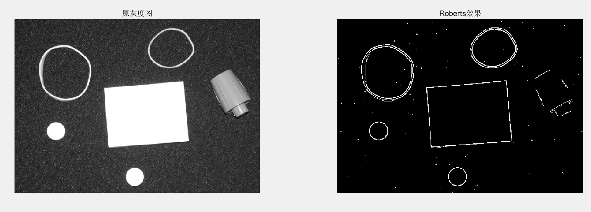

图2.bird.png：**scale = 0.1**

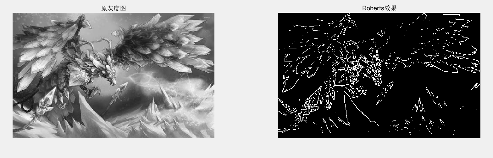

图3.giraffe.png：**scale = 0.1**

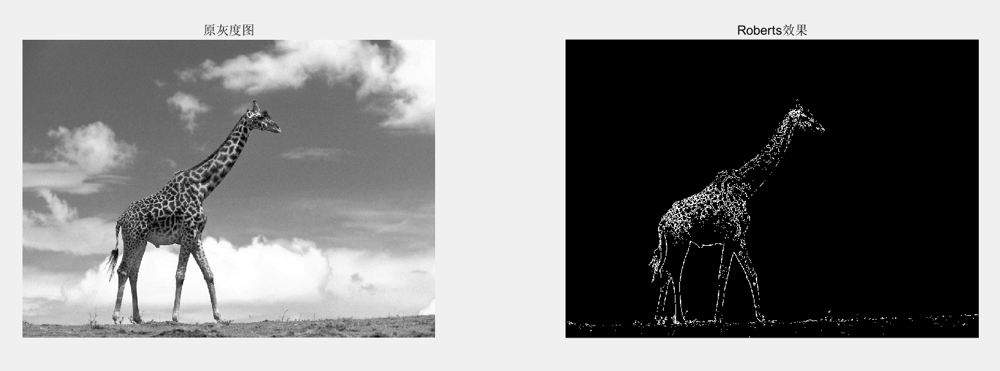

## <div STYLE="page-break-after: always;"></div>

图4.noise.png：**scale = 0.30**

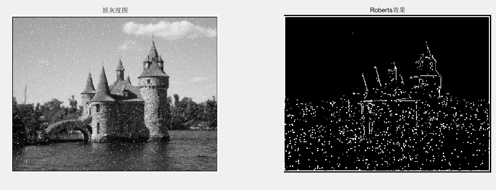

图5.noise2.png：**scale = 0.02**


## <div STYLE="page-break-after: always;"></div>

#### (2) Prewitt算子

图1.rubberband：cap.png  **scale = 1.8**

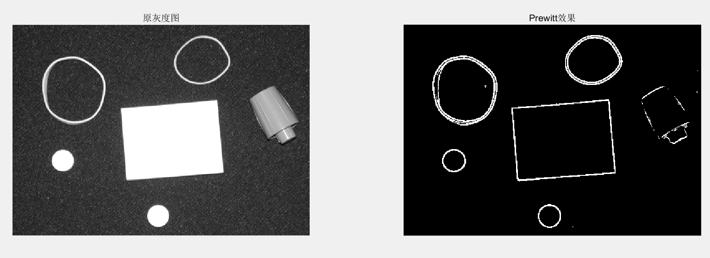

图2.bird.png：**scale = 0.5**

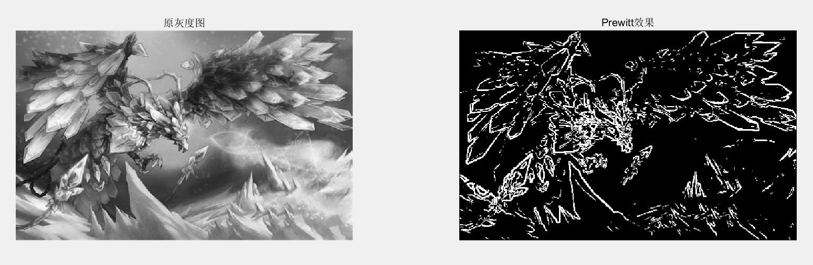

图3.giraffe.png：**scale = 0.5**

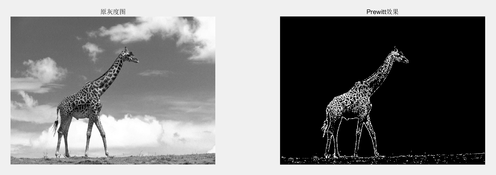

## <div STYLE="page-break-after: always;"></div>

图4.noise.png：**scale = 0.7**

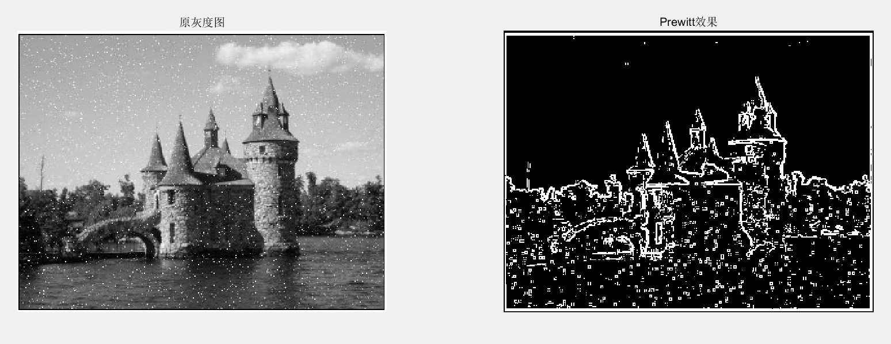

图5.noise2.png：**scale = 0.10**


## <div STYLE="page-break-after: always;"></div>

#### (3) Sobel算子

图1.rubberband：cap.png  **scale = 2.8**

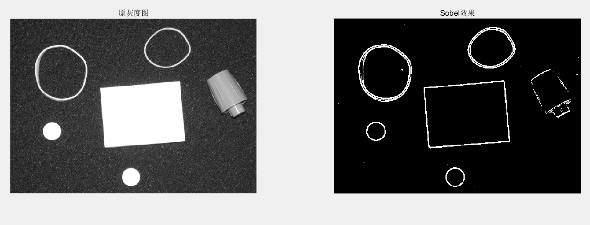

图2.bird.png：**scale = 1.3**

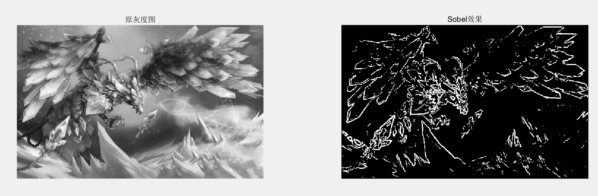

图3.giraffe.png：**scale = 1.0**

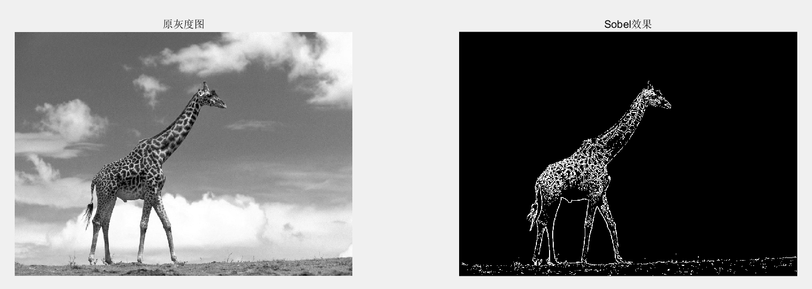

图4.noise.png：**scale = 1.9**

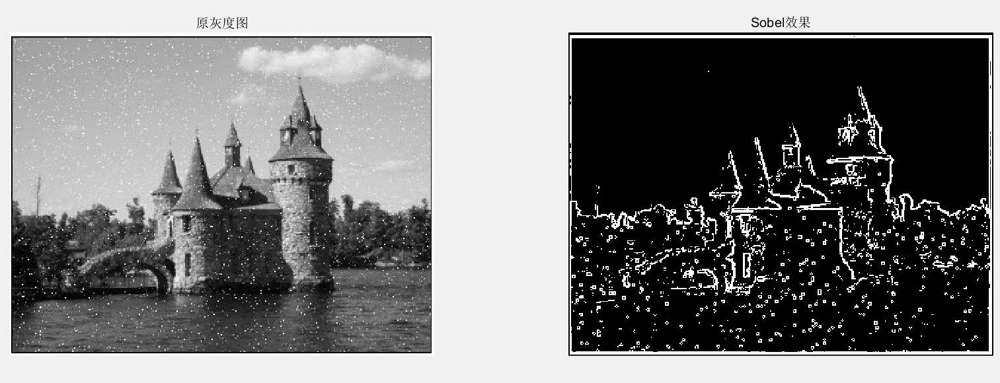

图5.noise2.png：**scale = 0.20**


#### (4) Marr-Hildreth边缘检测算法

图1.rubberband：cap.png  **scale = 0.30**


图2.bird.png：**scale = 0.1**


图3.giraffe.png：**scale = 0.1**


图4.noise.png：**scale = 0.30**


图5.noise2.png：**scale = 0.30**


#### (5) Canny边界检测器

图1.rubberband：cap.png  **scale = 0.30**


图2.bird.png：**scale = 0.1**


图3.giraffe.png：**scale = 0.1**


图4.noise.png：**scale = 0.30**


图5.noise2.png：**scale = 0.30**

