# 作业三：字符识别：从图片中计算加减算式结果

姓名：欧阳鸿荣	

学号：161220096 

邮箱：895254752@qq.com 

手机：13055644369


## 1. 实现细节

### 1.1 综述

以下是本次实验的代码文件及其功能

| 文件名             | 功能                          |
| ------------------ | ----------------------------- |
| **my_test**        | 字符识别和算式计算的测试入口  |
| **my_digit**      | 对于输入图片，识别图片中的数字                               |
| **my_operator** | 对于输入图片，识别图片中的运算符号    |
| **my_calculator** | 对于形如测试样例的图片，计算算式的计算结果，将结果写入图片并输出图片 |
| clear_boundary    | 对于给定图片，截取其最小外接矩形内的图像并返回 |
| caculate_line | 对于一行算式，识别其算式并返回结果 |
| test_ocr | 测试my_digit和my_operator识别的脚本 |

下面分别介绍本次实验的实现：

### 1.2 输入图片的性质：预处理的前提

根据实验要求，本次实验的输入图片都是形如如下格式的图片：

<div style="text-align:center">
    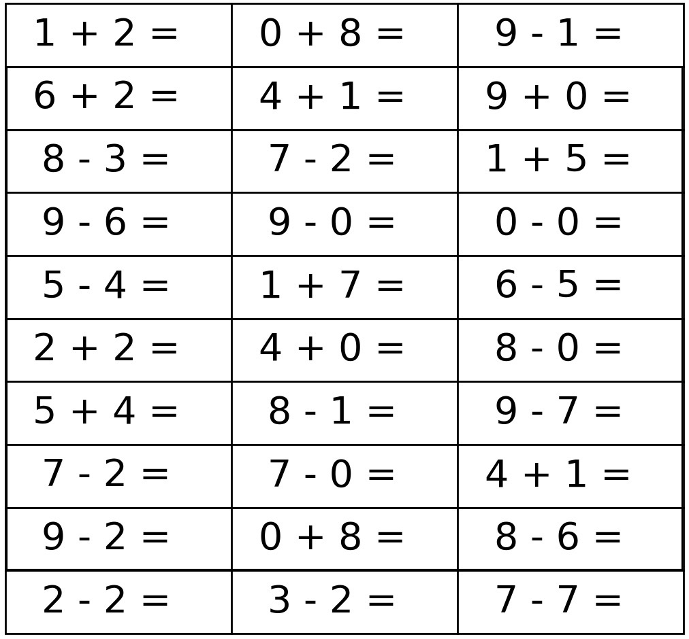
</div>

可以看出，待计算输入图片都是形如10*3的表格状，每个矩形框内是一个算式，格式都是：

1. 每行包含三个式子，一张图片共有10行；                                                      
2. 图片中仅包含加法和减法运算，且每个运算数都是小于10的自然数；                                                      
3. 给定的图片保证加法运算结果小于10，减法运算结果非负。 

可见本次实验已经大大简化了难度，因此根据该固定格式可以对输入图片预处理。

下面首先介绍一个对图片预处理的函数：clear_boundary

### 1.3 clear_boundary：定位关键图像所在的最小矩形

clear_boundary.m 函数的功能是：对图像进行预处理，去除其边缘，求出其最小外接矩形，定位在实验中我们所需的关键图像，而清除一些无效信息。该函数的一个应用如下图所示：

<div style="text-align:center">
    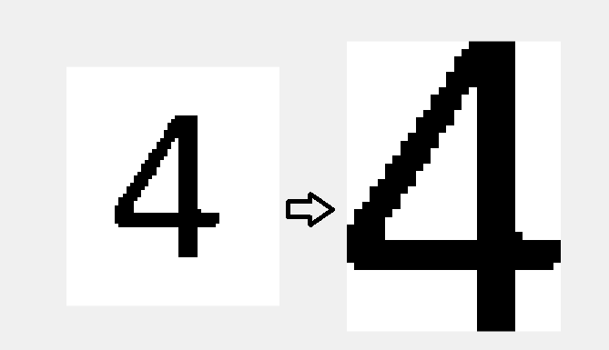
</div>
该函数的所用的算法思想如下：

1. 首先，函数起作用的前提是图像是一个二值图像
2. 在某个方向上，（以水平方向为例）按照列进行扫描，寻找在该列中是否有logcial值为0的像素点
3. 则得到列角度上像素是否存在的exist数组，呈条形码状分布
4. 对exist进行扫描，得到关键像素的起始和终止点，并将这部分的图片截取出来
5. 对另一个方向运用算法

下面是其水平方向按列扫描实现的代码：

```matlab
[m,n] = size(Im);
% 先去边框，试探空格
exist = [];
for i = 1:n
    tmp = find(Im(:,i)== 0);
    exist(i) = ~isempty(tmp);
end
% 分块
part = [];sflag = 0;eflag = 0;
for i = 1:length(exist)
    if(exist(i)==0 && sflag ==0 && eflag == 0)
        continue;
    elseif(exist(i)==1 && sflag ==0)
        sflag = i;
    elseif(exist(i)==0 && sflag ~=0)
        part = [part;[sflag,i]];
        sflag = 0;
    end
end
% 去边框后的图
left = part(1);
right = part(end);
```

### 1.4 my_calculator：对输入图片进行处理并返回结果图片

观察到测试样例图片的表格外缘都有一定间隔，因此对于输入图片，首先将其二值化，并使用clear_boundary清除其外缘，保证函数的处理总是对于一个标准的表格进行处理。

```matlab
Im = input_image;
RGB = Im;
Im = im2bw(Im); %二值化
Im =  clear_boundary(Im); %清除图片边缘，求最小外接矩形
L = size(Im);
[m,n] = size(Im);
```

然后，对于预处理后的图片，按照10行3列的格式，对图片进行分割，并且将分割后的结果以cell数组的形式存储

```matlab
%对图片按照方格进行划分
max_row = 10; %行数
max_col = 3; %列数

height = floor(L(1)/max_row); %每个算式方格的高度
width = floor(L(2)/max_col); %每个算式方格的宽度

seg = cell(max_row,max_col); %存储分割后每个位置的算式图片

%分块
for row = 1:max_row      
    for col = 1:max_col        
    seg(row,col)= {Im((row-1)*height+1:row*height,(col-1)*width+1:col*width,:)};   
    end
end 
```

之后，通过caculate_line函数，得到每个算式矩形的结果和其计算结果在图片中应该写入的偏移量

```matlab
%分别计算每个方格算式的结果
res = []; %存储计算结果
start = []; %记录结果相对于方格的偏移量
for i=1:max_row*max_col
    [a,b] = caculate_line(seg{i});
    res = [res,a];
    start = [start,b];
end
```

最后，通过insertText函数将结果写入原图，并且修正其结果在图片中的位置，使得结果出现在等号后的恰当位置

```matlab
%将结果写入原图并返回
for row = 1:max_row      
    for col = 1:max_col  
        index = (col-1)*max_row + row;
        scale = max_col*10; % 误差容许的缓冲量
        x = width*(col-1)+start(index)+n/scale; %结果的x坐标
        y = height*(row-1)+m/(scale-1); %结果的y坐标
        content = int2str(res(index)); %算式的计算结果
        off = m/(max_row*5); %写入图片结果的偏移量 
        position = [x,y+off]; %算式应该写入的位置
        RGB = insertText
        (RGB,position,content,'AnchorPoint','LeftCenter','FontSize',60,'BoxOpacity',0);
    end
end 
output = RGB;
```

### 1.5 caculate_line：对于包含一个算式的矩形，计算其结果

在my_calculator函数的介绍中有提到，将预处理后的图片分割成30个包含算式的小矩形，如下图：

<div style="text-align:center">
    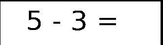
</div>

可以看出，分割的结果由于表格边界的存在并不是很理想，存在边框，caculate_line便是对形如上图的图片进行计算并返回结果和结果位置的函数。

首先，有一个比较激进的假设：边框占图片宽度的10%。然后对图片进行截取，得到不包含黑色边框的干净图片。

```matlab
Im = img;
[m,n] = size(Im);
% 先去边框
border = 10; %边框所占百分比
left = floor(m/border);
right = floor(m-m/border);
up = floor(n/border);
down = floor(n-n/border);
% 去边框后的图
Im =  Im(left:right,up:down);
[m,n] = size(Im);
```

然后，同clear_boundary的思想，对图片列的进行扫描（实际上clear_boundary函数从这里诞生）。由于图片的格式固定，因此对扫描后的坐标进行处理，分为 “数字 符号 数组 等号 空白”五部分，并存储在seg中，并同时得到结果应该出现在图片中的偏移量start，以便在my_calculator写入。

```matlab
last = part(4,2);
part = [part;[last+offset+1,last+offset]];
start = last+ offset + 1;

for col = 1:5
    seg(1,col)= {Im(1:height,part(col,1)-offset:part(col,2)+offset,:)};   
end
```

处理后的结果如下：

<div style="text-align:center">
    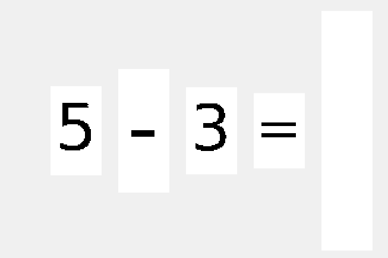
</div>

此时，我们便得到了分割后的数字和符号。于是便可以通过my_operator和my_digit函数对其分别进行识别，从而得到算式的计算结果，结果存储在res中返回。同时在控制台打印出结果，以便调试。

```matlab
if my_operator(seg{2})=='+'
    res = my_digit(seg{1})-'0' + my_digit(seg{3})-'0';
    display(strcat(my_digit(seg{1}),'+' ,my_digit(seg{3}),'=',int2str(res)));
else
    res = (my_digit(seg{1})-'0') - (my_digit(seg{3})-'0');
    display(strcat(my_digit(seg{1}),'-' ,my_digit(seg{3}),'=',int2str(res)));
end
```

### 1.6 my_operator：对于输入图片，识别图片中的运算符号  

该函数用于识别图像中的符号，识别的目标是加号，减号，等号共三个符号。函数的输入是单张运算符图片，输出是这张图片所表示的运算符。函数返回类型应是字符类型。

对于符号的识别，由于识别的目标只有三个符号，因此考虑从符号的特征进行识别，例如，对于测试样例中的三个符号，使用clear_boundary函数对其预处理后，可以得到如下图像：

<div style="text-align:center">
    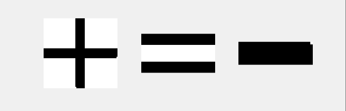
</div>

对于规则的运算符号，它们的图像特征和区别还是较为明显的的。这里选取像素密度来进行判别。所谓像素密度，指二值图像中0值像素点数占总像素数的百分比。而在经过与处理后，上述三个符号的像素密度分贝为为：

| 符号     | +      | -      | =      |
| -------- | ------ | ------ | ------ |
| 像素密度 | 0.2504 | 0.9962 | 0.5714 |

不同符号的像素密度差别较为明显的。因此可以考虑按照像素密度对其进行判别，同时根据图片比例辅以判断。

```matlab
function output = my_operator(input_image)

img = input_image;
img = clear_boundary(img);
[m,n] = size(img);
cnts = 0;
for i=1:m
    for j=1:n
        if img(i,j)==0
            cnts = cnts+1;
        end
    end
end
out = cnts/(m*n);
ra = m/n; %比例

if out>0.8 || ra < 0.3
    output = '-';
elseif out < 0.4 && ra > 0.7
    output = '+';
else
    output = '=';
end
```

### 1.7 my_digit：对于输入图片，识别图片中的数字  

对于数字的识别，这里给出两种方案，在实际使用时可以修改函数中的代码选择要使用何种方案。默认使用匹配法，该法识别速度快但是对数据集存在过拟合，适用性较差，若遇到问题可以采用函数法：

```matlab
function output = my_digit(input_image)
    output = true_digit(input_image);
    %output = func_digit(input_image);
end
```

#### (1) 函数法：使用matlab的ocr函数直接识别

OCR（Optical Character Recognition，光学字符识别）是指电子设备（例如扫描仪或数码相机）检查纸上打印的字符，通过检测暗、亮的模式确定其形状，然后用字符识别方法将形状翻译成计算机文字的过程。

在较新的matlab版本（未查到准确资料，但是根据文档，最晚在R2014a版本中即已经引入）中有ocr函数，可以对图片进行光学字符识别，设置参数TextLayout和CharacterSet后，对于给定图片即可达到良好的识别效果。

```matlab
function [output] = func_digit(input_image)
    % 使用
    word = ocr(input_image,'TextLayout','Word','CharacterSet','1234567890');
    if isempty(word.Words)
        output = word.Words;
    else
        output = word.Words{1};
    end    
end
```

#### (2) 匹配法：基于像素点的匹配对数字进行识别

匹配法是一个很基本很朴素的方法：对于截取出来的符号，与标准的数字模版进行匹配。返回匹配相似度最高的模版所代表的数字。相比于函数法，这个方法的泛化能力较差，但是对于特定字体的数字，可以做到快速识别。

首先，从测试样例中截图，得到数字的图片，置于```assert/image/numbers```中

<div style="text-align:center">
    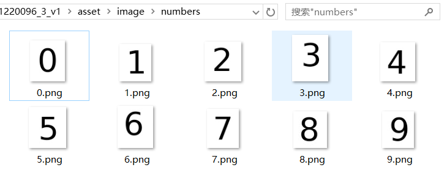
</div>

然后，利用genNormal函数，使用clear_boundary函数对数字去除边缘，进行切割定位，得到标准模版

```matlab
function genNormal()
    for i=0:9
        address = strcat('../asset/image/numbers/',int2str(i),'.png');
        input_image = imread(address); 
        input_image = im2bw(input_image);
        I = clear_boundary(input_image);
        [m,n] = size(I);
        subplot(10,2,2*i+1);imshow(input_image);
        subplot(10,2,2*(i+1));imshow(I);
        I = clear_boundary(input_image);
        imwrite(I,strcat('../asset/image/normal/',int2str(i),'.png'));   
        p = pblack(I);
    end
end
```

标准模版，置于```assert/image/nommal```中

<div style="text-align:center">
    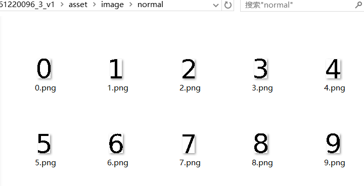
</div>

在true_digit函数中，对于输入的图片，首先将其去除边缘，然后，使用imresize标准化为40*25的数字图片。

```matlab
function [output] = true_digit(input_image)
%TRUE_DIGIT 用匹配的方法来匹配数字
%   此处显示详细说明
    I = clear_boundary(input_image);
    I = imresize(I,[40,25]);
    %...寻找最大匹配
    output = res + '0';
end
```

接着，对于每个样例，与标准化的模版一一比较，返回匹配相似度最高的模版所代表的数字

```matlab
function [output] = match(A,k)
    normal = imread(strcat('../asset/image/normal/',int2str(k),'.png')); 
    B=imresize(normal,[40,25]);
    if ~islogical(A) A = im2bw(A); end
    if ~islogical(B) B = im2bw(B); end
    cnts = 0;
    for i = 1:40
        for j=1:25
            if A(i,j)==B(i,j)
                cnts = cnts+1;
            end
        end
    end
    output = cnts;
end
```

## <div STYLE="page-break-after: always;"></div>

## 2. 结果

### 2.1 实验设置

实验环境为 **Matlab R2018a**，代码放在```code```目录下。其中```my_test.m```为从图片计算加减算式结果测试的入口。而对于数字和符号的识别测试，可以用```test_ocr.m```进行测试。下面讲述如何对代码进行测试。

#### 2.11 图片计算测试的设置

该环节测试的入口在```my_test.m```中，测试代码如下。只需修改文件路径即可对不同测试样例进行测试。控制台会打印对每个算式的处理结果，同时，测试结果会将处理前后图片对比展示输出在Figure窗口，并且可以通过修改代码选择将结果存储在文件系统上。

```matlab
clc; clear all;
imgInput = imread('../asset/image/example.png');
imgOutput = my_calculator(imgInput);

subplot(1, 2, 1);
imshow(imgInput);
subplot(1, 2, 2);
imshow(imgOutput);

% imwrite(imgOutput,strcat('../asset/image/5_result.png'));   
```

#### 2.12 符号和数字的识别测试

该环节测试的入口在```test_ocr.m```中，分别有两个测试函数：

| 测试函数名    | 测试函数功能和使用                                           |
| ------------- | ------------------------------------------------------------ |
| testOperators | 测试符号的识别，修改输入文件路径，控制台输出识别结果（字符类型） |
| testNumbers   | 测试数字的识别，修改输入文件路径，控制台输出识别结果（字符类型） |
|               | 同时，通过修改my_digit中的方法函数可以选择测试匹配法和ocr函数法的结果 |

### 2.2 实验结果

#### 2.21 图片计算测试的实验结果

如果输入图片名是“1.png”，那么在image文件夹中相应的输出图片名字应该是“1_result.png”。

对于所给的6张测试图片进行测试，结果如下：

- example.png

  <div style="text-align:center">
      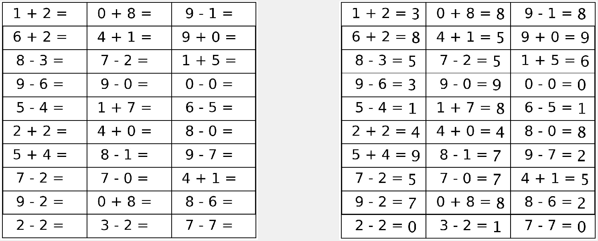
  </div>

- 1.png

  <div style="text-align:center">
      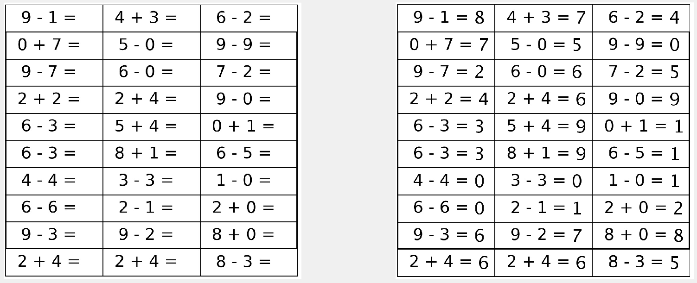
  </div>

- 2.png

  <div style="text-align:center">
      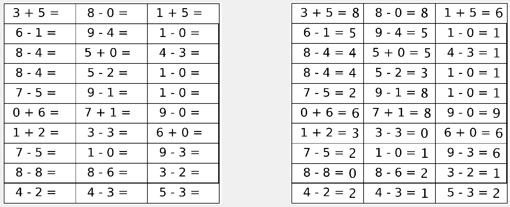
  </div>

- 3.png

  <div style="text-align:center">
      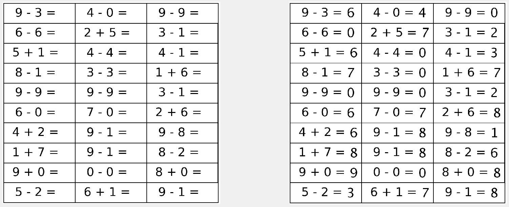
  </div>

- 4.png

  <div style="text-align:center">
      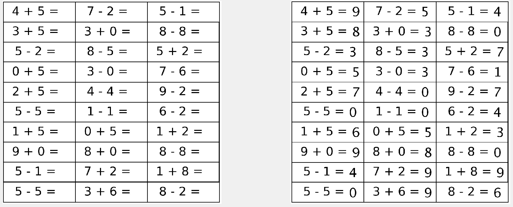
  </div>

- 5.png

  <div style="text-align:center">
      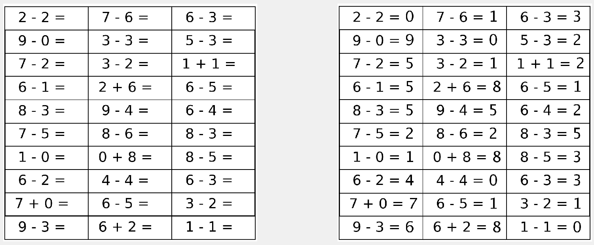
  </div>


#### 2.22 符号和数字识别的实验结果

##### (1) 符号的识别：

##### 印刷体的识别：

- 加号

  <div style="text-align:center">
      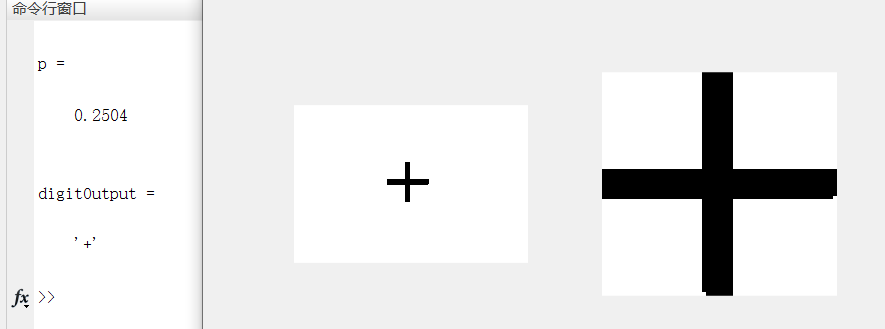
  </div>

- 减号

  <div style="text-align:center">
      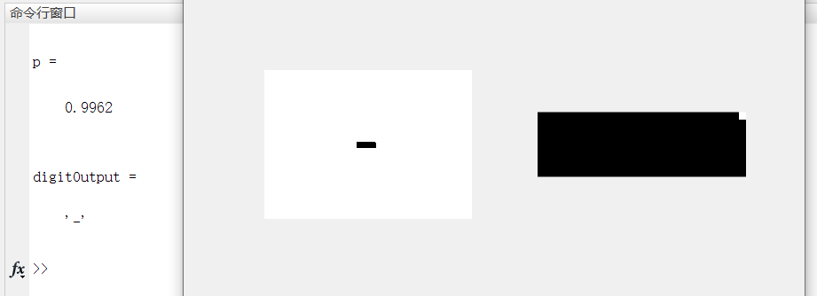
  </div>

- 等号

  <div style="text-align:center">
      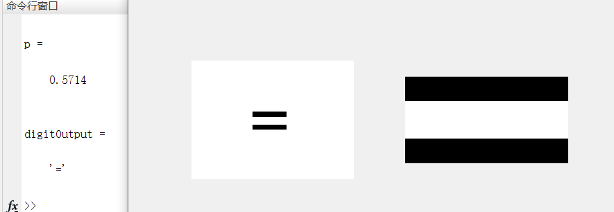
  </div>

##### 手写体的识别：

- 加号

  <div style="text-align:center">
      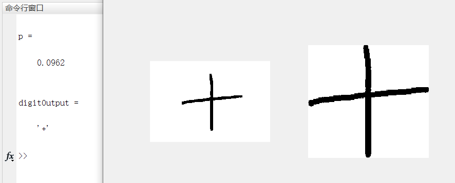
  </div>

- 减号

  <div style="text-align:center">
      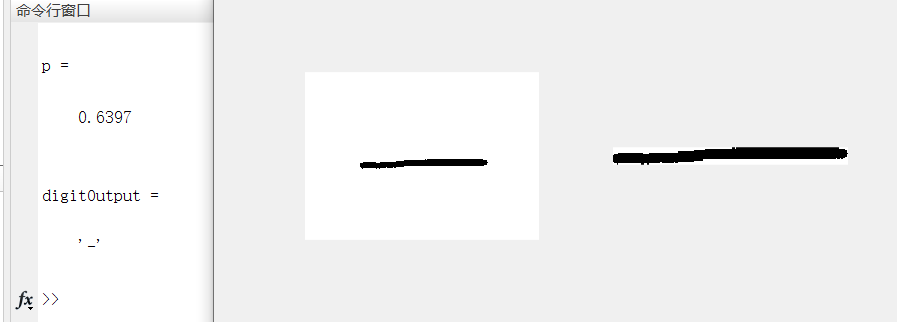
  </div>

- 等号

  <div style="text-align:center">
      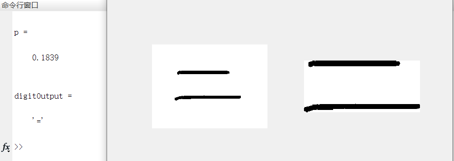
  </div>

可以看出，用像素比例结合比例，对于符号的识别效果较好，且对于鼠绘符号也能做到一定精度识别。

##### (2) 数字的识别：


##### 